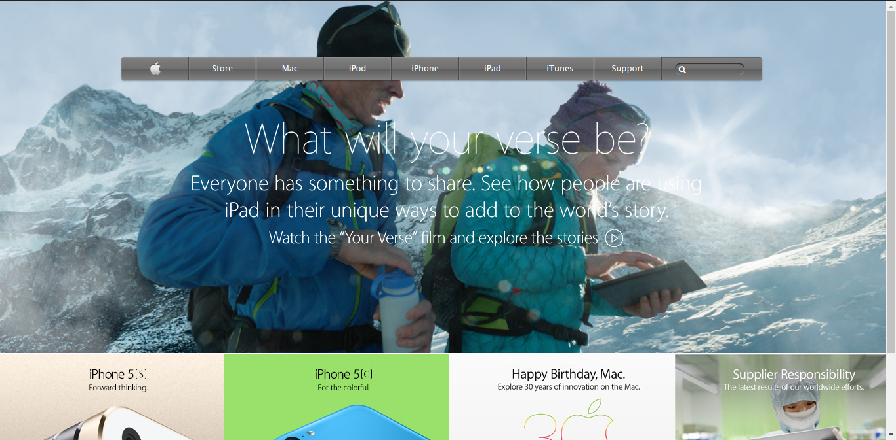

# Youtube Clone

> This is an Apple landing page clone from 2014 for practicing background images and gradients.

- Archive: https://web.archive.org/web/20140301004610/http://www.apple.com/

## Built With

- HTML5, CSS3
- Grid, Floats

## Live Demo

[Live Demo Link](https://lbuggie.github.io/apple-2014-clone/)

## Authors

👤 **Author1**

- Github: [@lBuggie](https://github.com/githubhandle)
- Twitter: [@sebGilR](https://twitter.com/sebGilR)
- Linkedin: [linkedin](https://www.linkedin.com/in/sebasti%C3%A1n-gil-rodr%C3%ADguez-9b776073/)

## 🤝 Contributing

Contributions, issues and feature requests are welcome!

Feel free to check the [issues page](issues/).

## Show your support

Give a ⭐️ if you like this project!

